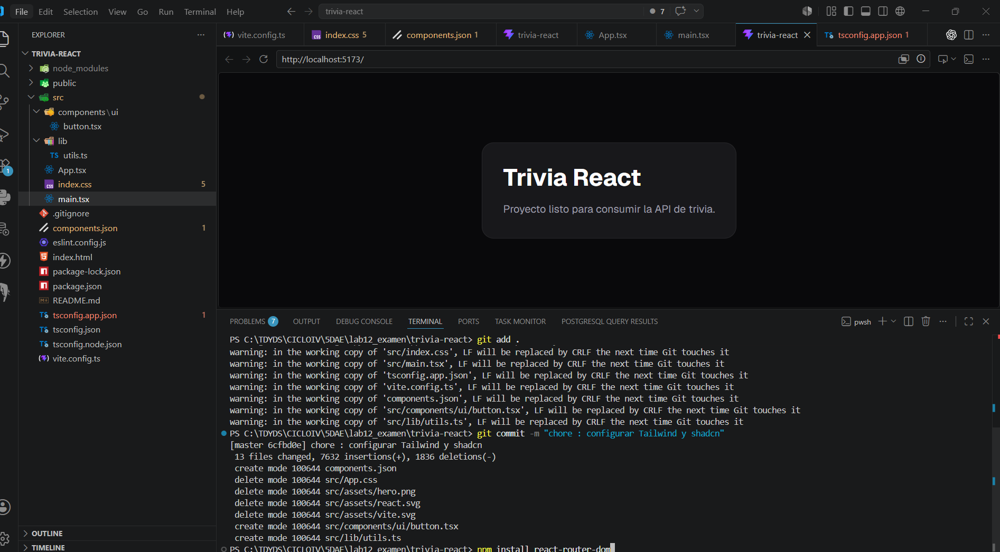
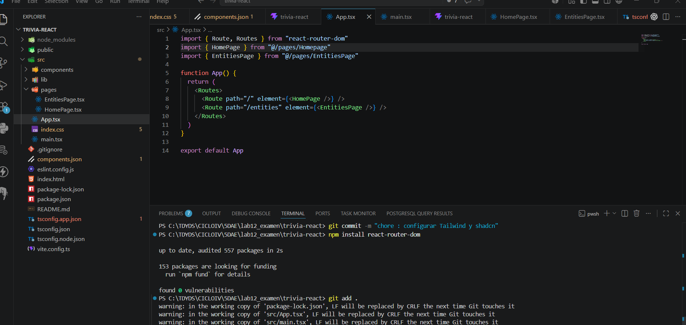
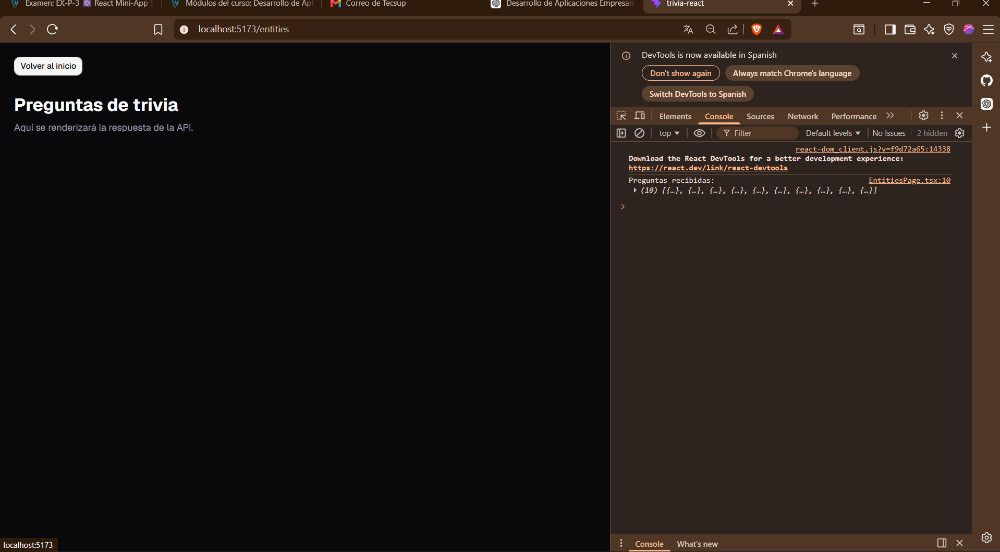
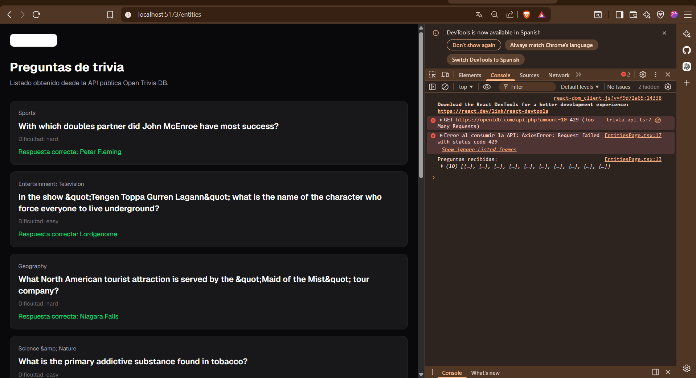
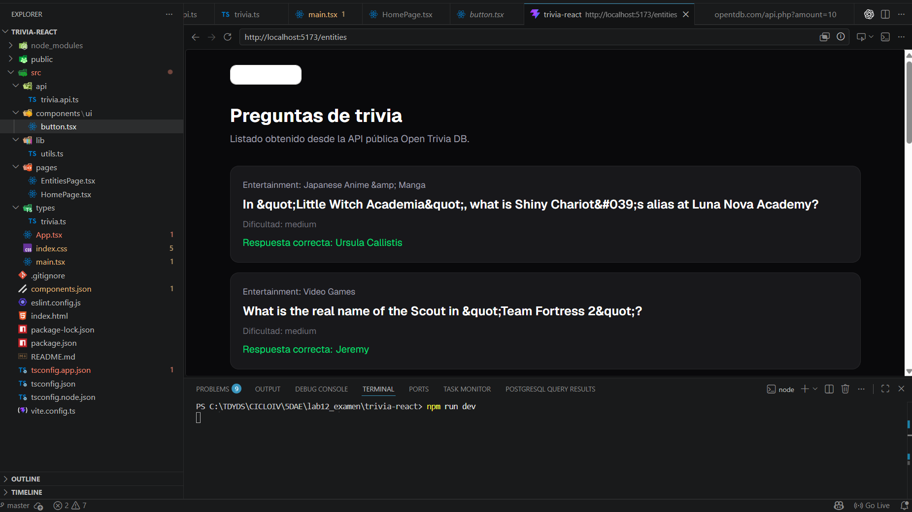
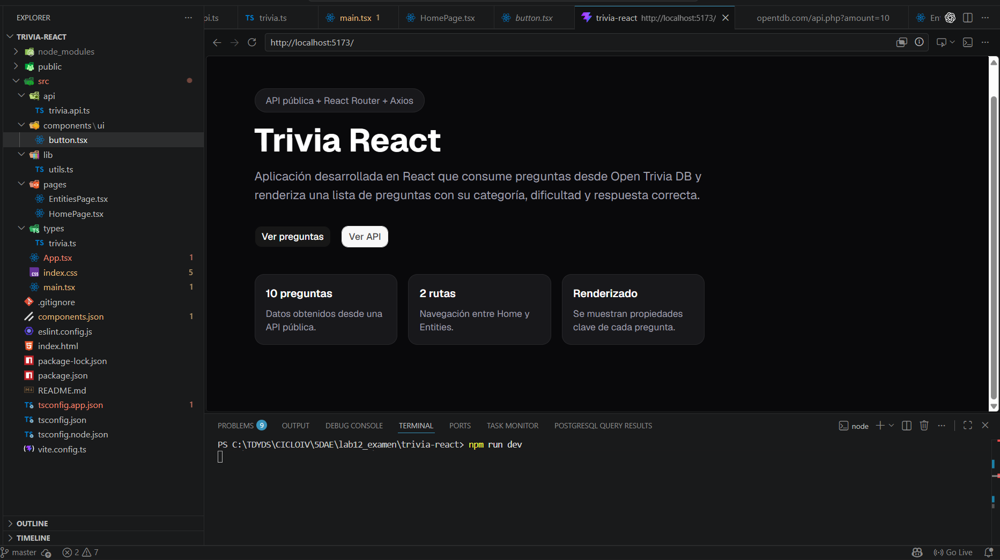
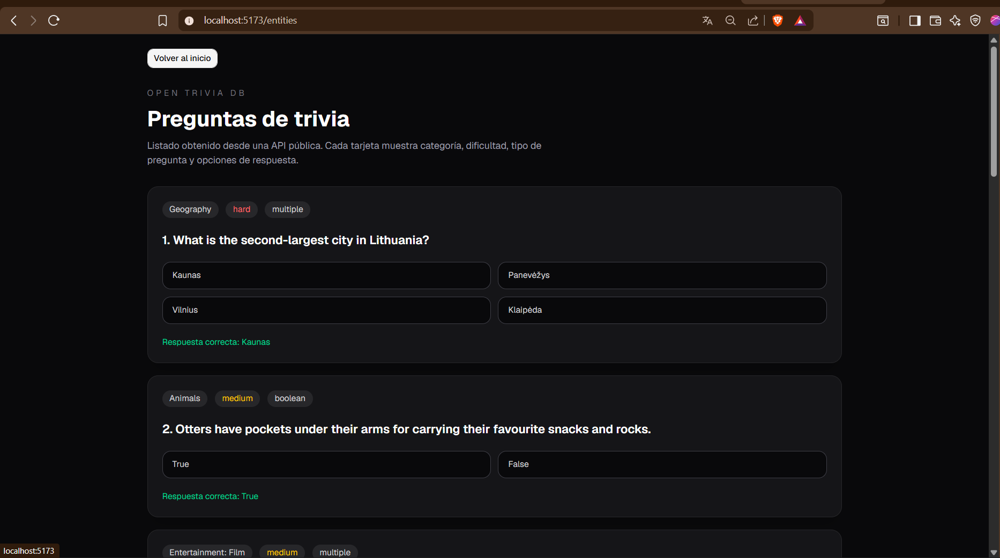

# Trivia React 🎯

## Descripción

Trivia React es una aplicación web desarrollada con React y TypeScript que consume preguntas desde la API pública Open Trivia DB.

La aplicación permite visualizar preguntas de trivia obtenidas dinámicamente desde un endpoint externo, mostrando información como categoría, dificultad, tipo de pregunta y respuesta correcta.

Además, implementa navegación mediante React Router y una interfaz moderna utilizando Tailwind CSS y Shadcn UI.

---

## Tecnologías Utilizadas

* React 19
* Vite
* TypeScript
* React Router DOM
* Axios
* Tailwind CSS v4
* Shadcn UI

---

## API Utilizada

https://opentdb.com/api.php?amount=10

---

## Características

* Consumo de API pública mediante Axios.
* Navegación entre rutas utilizando React Router.
* Renderizado dinámico de preguntas.
* Visualización de categoría, dificultad y respuesta correcta.
* Interfaz moderna desarrollada con Tailwind CSS y Shadcn UI.

---

## Estructura de Rutas

### Home

Ruta:

```txt
/
```

Muestra la información principal del proyecto y acceso al listado de preguntas.

### Entities

Ruta:

```txt
/entities
```

Muestra las preguntas obtenidas desde la API pública.

---

## Instalación y Ejecución

Clonar el repositorio:

```bash
git clone URL_DEL_REPOSITORIO
```

Ingresar al proyecto:

```bash
cd trivia-react
```

Instalar dependencias:

```bash
npm install
```

Ejecutar el servidor de desarrollo:

```bash
npm run dev
```

Abrir en el navegador:

```txt
http://localhost:5173
```

---

## Commits Realizados

* chore: configurar Tailwind y shadcn

* feat: configurar rutas con React Router

* feat: consumir api de trivia con axios

* feat: renderizar preguntas de trivia


* feat: completar ruta home

* style: mejorar interfaz de preguntas

---

## Deploy

https://lab12-evaluaci-n-dae.vercel.app/

